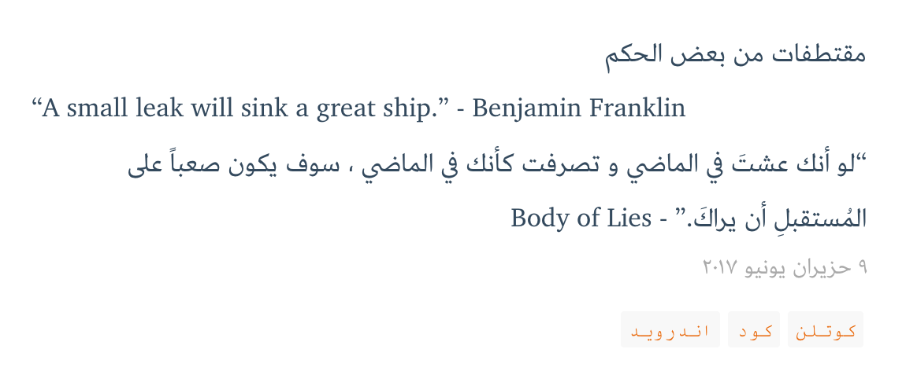

# Rexo = RTL + Hexo 
[Live Example](https://bluemix.github.io/)

Rexo is a minimally customized version of [Vexo](https://github.com/yanm1ng/hexo-theme-vexo)

  


## Features

* RTL (e.g., Arabic, Hebrew, and Persian)
* Disqus comments
* Emoji left sidebar


## Post

The **front-matter** of a post looks like that:

```yaml
---
title: زهرة النرجس
date: 2017-07-27 10:42:29
lang: ar
direction: rtl
tags:
 - أزهار
 - نباتات
---
```

  Please note
  
  You can use [rtl](dfdf) and [ltr]() plugin tags to allow mixed wirtings, i.e.,
```
مقتطفات من بعض الحكم


“A small leak will sink a great ship.” - Benjamin Franklin


"لو أنك عشتَ في الماضي و تصرفت كأنك في الماضي ، سوف يكون صعباً على المُستقبلِ أن يراكَ." - Body of Lies

```

  
## Install

1. Download/Checkout this theme into your project

   ```
   cd your-hexo-folder

   git clone https://github.com/bluemix/hexo-theme-rexo.git themes/rexo

   cp -R themes/rexo/_source/* source/
   ```

2. Modify `_config.yml` with your own info. look like this

   ```
   themes: rexo
   ```

   Here theme's name must same as the theme folder name.

3. Or you can copy my theme `_config.yml` into you hexo blog directory , replace default `_config.yml`

4. That's all , hope you will like :)


## Logo
You can replace your own logo in `themes/source/css/images` 

## Links

You can easily add your social account by just adding your settings into `_config.yml`


## LICENSE
MIT